# אתר שיתופי לצילום PicShare
## סקירה כללית
אתר זה הינו אתר שיתופי בנושא הצילום. <br>
ניתן לקבל המלצות מפוסטים לגבי: צלמים מקצועיים, לוקיישנים מיוחדים לצילום, אביזרי צילום להשכרה/למכירה, וכן טיפים לצילום מהמומחים.<br>
משתמשים שרשומים לאתר יכולים להעלות פוסטים עם המלצות בנושאים אלה, לצרף תמונה לפוסט להמחשה, וכן להגיב על פוסטים קיימים ולדרג אותם.<br>
בפרופיל יכול המשתמש לראות את פרטיו האישיים, את כל הפוסטים שהעלה, לצפות בהם, לערוך או למחוק אותם. וכן קיימות אופציות של התנתקות מהחשבון ומחיקת החשבון.<br><br>
## מאפיינים
- הרשמה/התחברות למערכת ע"י פרטים אישיים, כתובת דוא"ל וסיסמה של החשבון.
- צפייה בפרופיל המשתמש, שם רשומים פרטיו האישיים והפוסטים שהעלה. יש אפשרות לצפות בפוסטים של הפרופיל, לערוך או למחוק אותם. וכן ניתן להתנתק מהחשבון או למחוק אותו לצמיתות.
- צפייה בפוסטים שהועלו, גם אדם שאינו רשום כמשתמש רשאי לצפות בפוסטים.
- כתיבת פוסט לפי קטגוריה, בצירוף תמונה.
- תגובה ודירוג לפוסט קיים.
  <br><br>
## שימוש בטכנולוגיות
- **צד השרת:** Java (Spring Boot).
- **צד הלקוח:** React (Redux).
- **ספריית עיצוב:** MUI (Material UI).
- **מסד הנתונים:** H2. (לאחסון הנתונים בלבד)
<br>

 ## התקנה
 ראשית הורד את הקובץ למחשב המקומי שלך ע"י הפקודה הבאה בשורת הפקודה של התיקייה הרצויה:
 ```bash
git clone https://github.com/shirabiton/PicShare.git
```

### התקנה בצד השרת: 
פתח את הפרויקט בסביבת העבודה IntelliJ IDEA או Eclipse והרץ את השרת (לחץ על run).
לאחר מכן, פתח את כתובת הדפדפן:
```bash
http://localhost:8585/h2-console
```
שם תוכל לראות את מסד הנתונים שמור בטבלאות.

### התקנה בצד הלקוח:
פתח את שורת הפקודה של תיקיית צד הלקוח שבפרויקט, כתוב:
```bash
code .
```
ואז Enter. כך ייפתח לך הפרויקט ב Visual Studio Code. <br>
כעת הרץ את הפרויקט על ידי הפקוודה בטרמינל: 
```bash
npm run dev
```
<br>

  ## תלויות חיצוניות
  כפי שצויין, בצד הלקוח מותקנת הספרייה MUI (Material UI), זוהי ספרייה עיצובית של React.
  נתקין אותה על ידי הפקודה הבאה בטרמינל:
```bash
npm install @mui/material @emotion/react @emotion/styled
```
וכן קיים שימוש בספרייה Sweet Alert המספפקת הודעות alert מעוצבות ורספונסיביות. 
נתקין אותה על ידי הפקודה: 
```bash
npm install sweetalert2
```
או לחילופין, להתקין בקלות כל התקנה שהיא בפרויקט על ידי פקודה אחת:
```bash
npm install @mui/material @emotion/react @emotion/styled
```
<br>

## אופן השימוש
מדף הבית ניתן להתחבר/להירשם על ידי לחיצה על: "התחבר/הירשם" בכותרת העליונה. <br>
נוכל לנווט ל"קצת עלינו" לדף אודות האתר, <br>
וכן, לנווט לפרופיל שלנו בלחיצה על האווטאר של החשבון שלנו. <br>
לחיצה על "פוסטים" תוביל אותנו למאגר פוסטים שהועלו, בסרגל הצד ננווט בין הקטגוריות השונות עבור המלצות לצילום. <br>
ניתן לחפש פוסטים על ידי חיפוש מהיר של כותרת הפוסט בכותרת העליונה של האתר. <br>
בכל שלב, לחיצה על הלוגו תוביל אותנו לדף הבית, ובכל עמוד אם נגלול למטה נוכל לעלות לראש הדף על ידי לחיצה על אייקון של חץ כלפי מעלה. <br>
לחיצה על פוסט תוביל אותנו לדף הפוסט המלא, בראש הפוסט נראה מיהו בעל הפוסט, ואז את התמונה והטקסט, בהמשך הדף יוצג הדירוג והתגובות, <br>
שם, בתור משתמשים נהיה רשאיים לדרג ולהגיב על הפוסט. <br>
ישנו כפתור מרחף עם אייקון של פלוס בדף הפוסטים, דרכו נוכל להעלות פוסטים חדשים ולצרף להם תמונה. <br><br>

## צילומי מסך
דף הבית:<br><br>
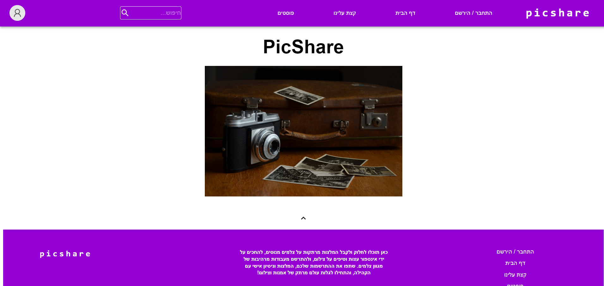<br><br>
הרשמה:<br><br>
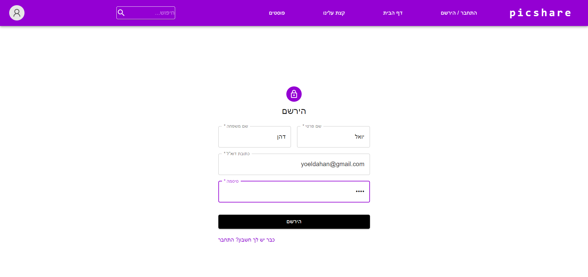<br><br>
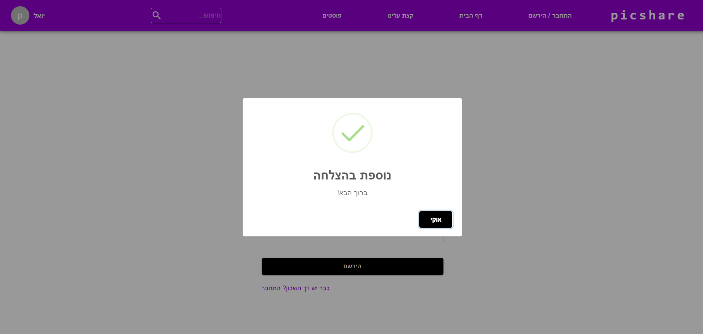<br><br>
התחברות:<br><br>
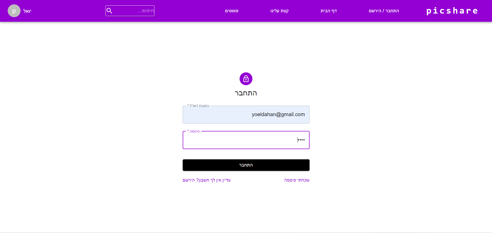<br><br>
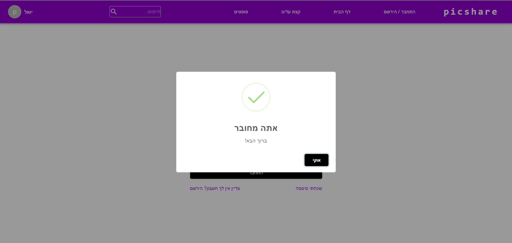<br><br>
אודות:<br><br>
<br><br>
הוספת פוסט:<br><br>
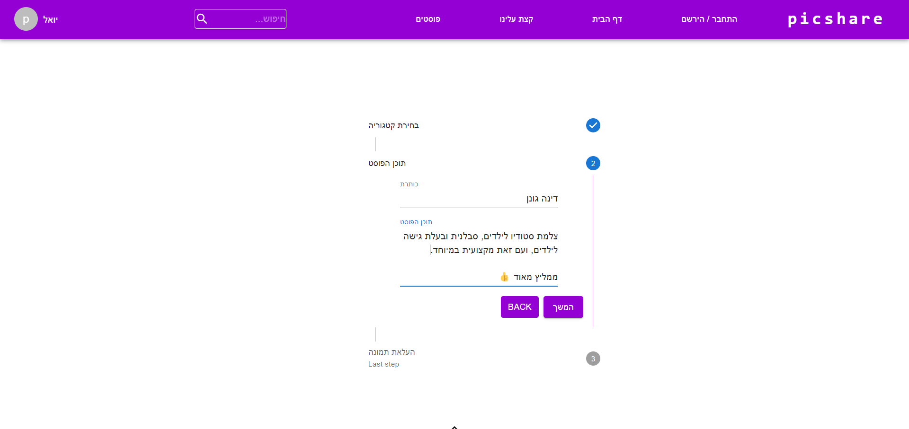<br><br>
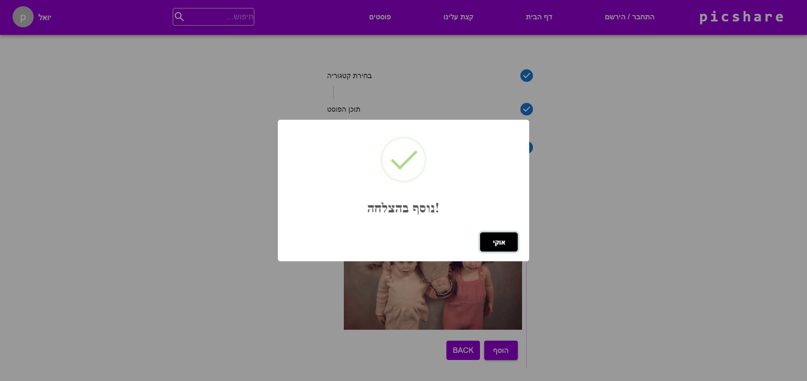<br><br>
כל הפוסטים:<br><br>
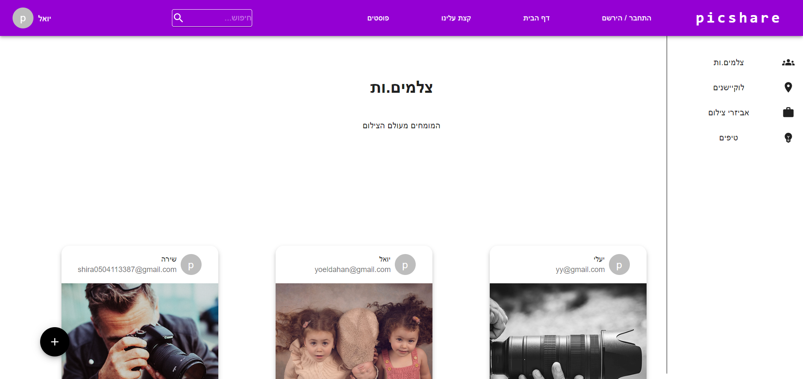<br><br>
חיפוש מהיר בפוסטים:<br><br>
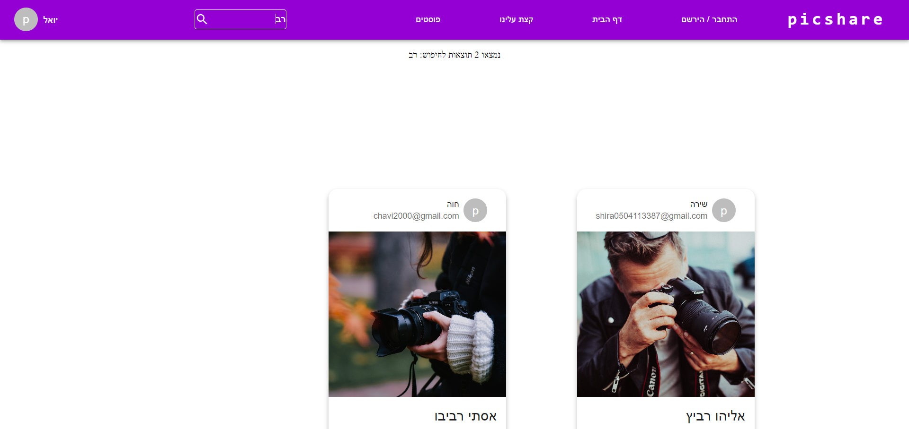<br><br>
פרטי הפוסט:<br><br>
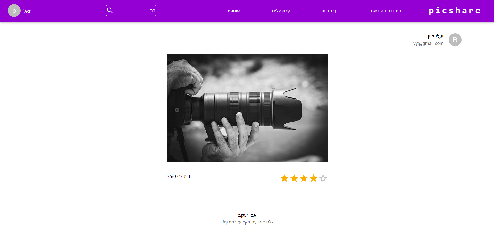<br><br>
הוספת תגובה:<br><br>
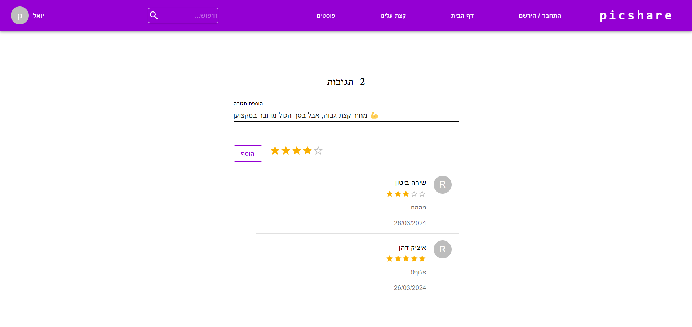<br><br>
התגובות לפוסט:<br><br>
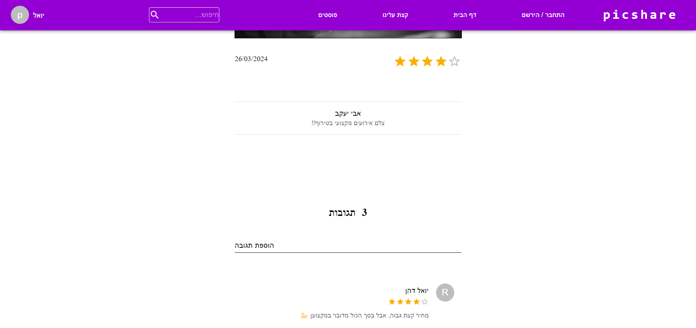<br><br>
הפרופיל שלי:<br><br>
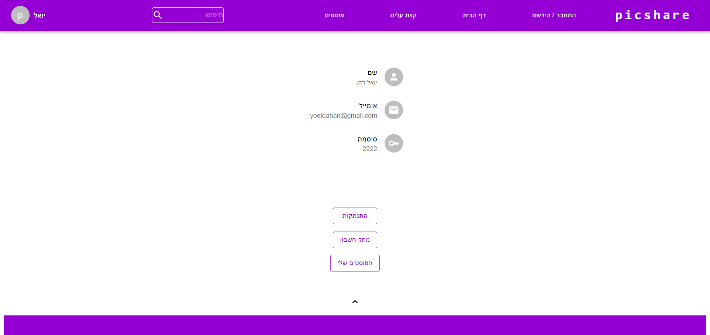<br><br>
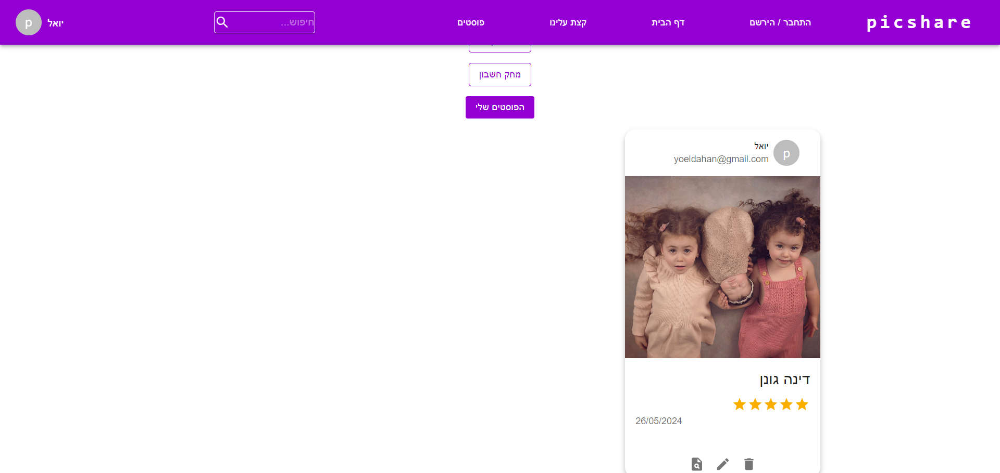<br><br>
